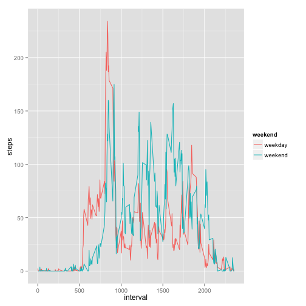
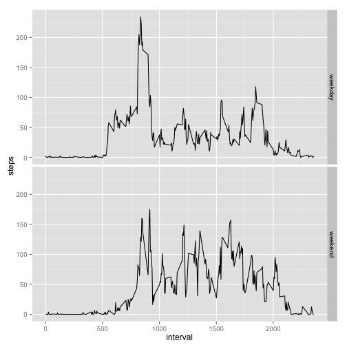

# Reproducible Research: Peer Assessment 1


## Loading and preprocessing the data


```r
data <- read.csv(unzip("activity.zip"))
summary(data)
```

```
##      steps               date          interval   
##  Min.   :  0.0   2012-10-01:  288   Min.   :   0  
##  1st Qu.:  0.0   2012-10-02:  288   1st Qu.: 589  
##  Median :  0.0   2012-10-03:  288   Median :1178  
##  Mean   : 37.4   2012-10-04:  288   Mean   :1178  
##  3rd Qu.: 12.0   2012-10-05:  288   3rd Qu.:1766  
##  Max.   :806.0   2012-10-06:  288   Max.   :2355  
##  NA's   :2304    (Other)   :15840
```

## What is mean total number of steps taken per day?

### Histogram of steps

```r
z<-aggregate(steps~date, data, sum)
histinfo <- hist(z$steps, breaks = 20)
```

 

```r
histinfo
```

```
## $breaks
##  [1]     0  1000  2000  3000  4000  5000  6000  7000  8000  9000 10000
## [12] 11000 12000 13000 14000 15000 16000 17000 18000 19000 20000 21000
## [23] 22000
## 
## $counts
##  [1]  2  0  1  1  1  2  1  2  5  2 10  6  6  4  2  5  0  1  0  0  1  1
## 
## $density
##  [1] 3.774e-05 0.000e+00 1.887e-05 1.887e-05 1.887e-05 3.774e-05 1.887e-05
##  [8] 3.774e-05 9.434e-05 3.774e-05 1.887e-04 1.132e-04 1.132e-04 7.547e-05
## [15] 3.774e-05 9.434e-05 0.000e+00 1.887e-05 0.000e+00 0.000e+00 1.887e-05
## [22] 1.887e-05
## 
## $mids
##  [1]   500  1500  2500  3500  4500  5500  6500  7500  8500  9500 10500
## [12] 11500 12500 13500 14500 15500 16500 17500 18500 19500 20500 21500
## 
## $xname
## [1] "z$steps"
## 
## $equidist
## [1] TRUE
## 
## attr(,"class")
## [1] "histogram"
```

### Mean of summary of steps


```r
mean(z$steps)
```

```
## [1] 10766
```

### Median of summary of steps

```r
median(z$steps)
```

```
## [1] 10765
```

## What is the average daily activity pattern?

### Time Series Plot on average steps grouped by interval

```r
y<-aggregate(steps~interval, data, mean)
plot.default(x=y$interval, y=y$steps, type="l", xlab="Interval Series", ylab="Mean Steps")
```

 
### Which interval has the highest steps performed

The highest steps performed are in interval 835 with 206.1698 steps

```r
subset(y, y$steps == max(y$steps))
```

```
##     interval steps
## 104      835 206.2
```

## Imputing missing values

1. Identify all n/a entries
2. Generate mean by Interval
3. Replacing n/a entries by mean from second step and combine data completecases with data from replacing frame
    
    

```r
  # Step 1
    na <- subset(data, !complete.cases(data))
  # Step 2
    y<-aggregate(steps~interval, data, mean)
  # Step 3
    output <- merge(na, y, by = 'interval', all.y = F)
    output <- output[,c('steps.y','date','interval')]
    names(output)[1] <- c("steps")

    complete <- subset(data, complete.cases(data))
    filledActivity <- rbind (complete, output)

  # Histogramm
    z<-aggregate(steps~date, filledActivity, sum)
    histinfo <- hist(z$steps, breaks = 20)
```

 
### Mean of summary of steps


```r
mean(z$steps)
```

```
## [1] 10766
```

### Median of summary of steps

```r
median(z$steps)
```

```
## [1] 10766
```
## Are there differences in activity patterns between weekdays and weekends?

### Identifying weekdays

```r
 t <- transform(data, weekend=weekdays(as.Date(data$date)) %in% c("Samstag","Sonntag"))
 index <- c(TRUE, FALSE)
 values <- c("weekend", "weekday")
 t$weekend <- factor(values[match(t$weekend, index)])
 summary(t)
```

```
##      steps               date          interval       weekend     
##  Min.   :  0.0   2012-10-01:  288   Min.   :   0   weekday:12960  
##  1st Qu.:  0.0   2012-10-02:  288   1st Qu.: 589   weekend: 4608  
##  Median :  0.0   2012-10-03:  288   Median :1178                  
##  Mean   : 37.4   2012-10-04:  288   Mean   :1178                  
##  3rd Qu.: 12.0   2012-10-05:  288   3rd Qu.:1766                  
##  Max.   :806.0   2012-10-06:  288   Max.   :2355                  
##  NA's   :2304    (Other)   :15840
```

### Perform Graph


```r
library(ggplot2)
library(reshape)
y<-aggregate(steps~weekend+interval, t, mean)
ggplot(y, aes(x = interval, y =steps, color=weekend)) + geom_line()
```

 

```r
ggplot(data = y, aes(x = interval, y =steps)) + geom_line() + facet_grid(weekend ~ .)
```

 
